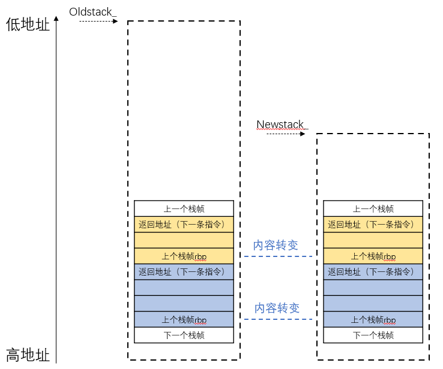
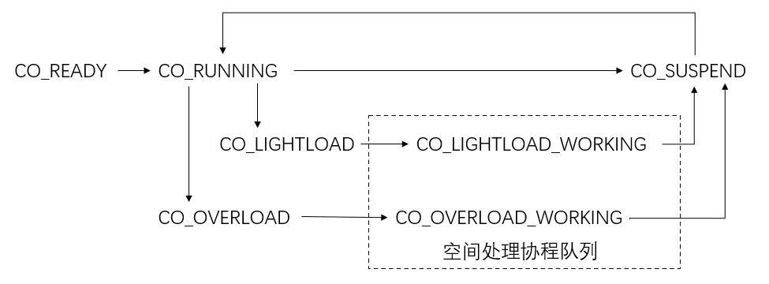

# 项目介绍

base_private_stack_V1：最基本的协程库，协程的栈空间在生命周期内都是固定的

oneThread_private_stack：单线程协程库，协程栈空间会根据当前空间使用量灵活伸缩

twoThread_private_stack：双线程协程库，协程运行与协程栈空间伸缩是并行处理，同时新增协程状态切换内容

## 协程私有栈内容的迁移

在进行协程私有栈内容迁移时，需要注意如下两点：

①从私有栈栈顶一直到指针stack_ + stack_size指向的所有空间，这些空间上的所有内容都需要迁移。同时由于本项目是基于ucontext组件实现的，上下文的切换依赖于swapcontext，因此还需要另行修改uc_mcontext里边的gregs指针（在x86_64中，需要修改REG_RSP和REG_RBP）指针

②栈内容迁移时，与栈帧相关的rbp指针内容也需要做更改，这是因为在迁移时，旧栈帧的rbp指向的仍然是旧的上一个栈帧的rbp。若不更改，则在迁移完毕并且释放Oldstack_指向的空间后，新栈里边的rbp指针仍然指向的是**旧的函数调用地址**，使得rbp栈帧调用链失效。因此需要根据Newstack\_ - Oldstack\_的偏移量，去更改这些rbp指针

## 协程状态转换

CO_READY：协程及其上下文已经创建完毕

CO_RUNNING：协程正在运行

CO_LIGHTLOAD/CO_OVERLOAD：协程栈空间太大/太小，需要调整，需要被压入处理队列中

CO_LIGHTLOAD_WORKING/CO_OVERLOAD_WORKING：协程栈空间太大/太小，协程已经在处理队列中，正在等待被处理（在单线程协程库中，协程运行与协程栈空间处理是串行的；在双线程架构中，协程运行与协程栈空间伸缩是并行处理）

CO_SUSPEND：协程被挂起，正在等待被运行